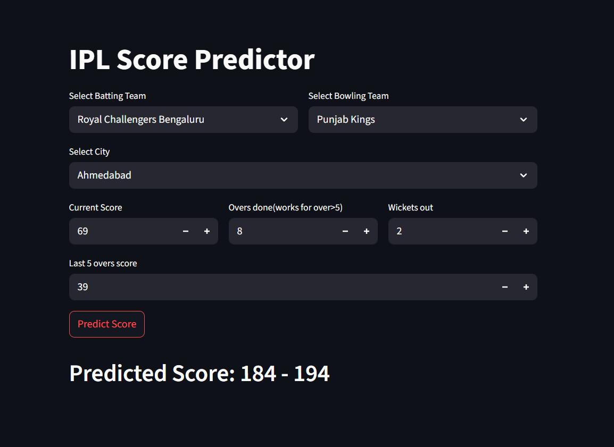

# IPL Score Predictor (1st Innings)

This project is a **Streamlit-based web application** that predicts the expected first-innings score in an IPL match based on user inputs like venue, batting team, bowling team, and overs played.

The machine learning model for this predictor was trained and optimized separately (not included in this repository). This repo is focused purely on the **Streamlit deployment** of the already-trained model for user interaction and live predictions.

---

## Tech Stack

- Python
- Streamlit
- scikit-learn

## 🚀 Live Demo

Check out the live deployed app here:  
👉 [IPL 1st Innings Score Predictor on Streamlit](https://ipl-1st-inning-score-predictor.streamlit.app/)

  
  &nbsp;
  

## Example

For illustration, consider the above match scenario:

- **Match**: RCB vs PBKS, held in Ahmedabad  
- **Batting**: RCB (first innings)  
- **Overs completed**: 8  
- **Current score**: 69 runs for 2 wickets  
- **Last 5 overs runs**: 9, 7, 9, 6, 8 (total 39 runs)

Feeding these details into the model predicted a first-innings total in the range of **184–194 runs**. The actual final first-innings score turned out to be **190 runs for 9 wickets**, demonstrating good predictive performance with approximately 96% accuracy.

---

## Features

- User-friendly Streamlit interface  
- Inputs for venue, teams, and overs  
- Predicts estimated first-innings total  
- Quick and lightweight deployment

---

## Note

This repository **does not** include Jupyter notebooks for model training or feature extraction. It contains only the deployment code for running the pre-trained model via Streamlit.

---

## How to Run Locally

1. Clone the repository  
git clone https://github.com/sharad0x/IPL-score-predictor.git
2. Install requirements  
pip install -r requirements.txt
3. Run Streamlit  
streamlit run app.py
4. Open `http://localhost:8000` in your browser or any other port mentioned in the terminal.

---

## License

This project is for educational purposes. Feel free to fork and adapt!

---

*For any queries or collaboration, feel free to reach out via [LinkedIn](https://www.linkedin.com/in/sharad-garg-745632287).*  
